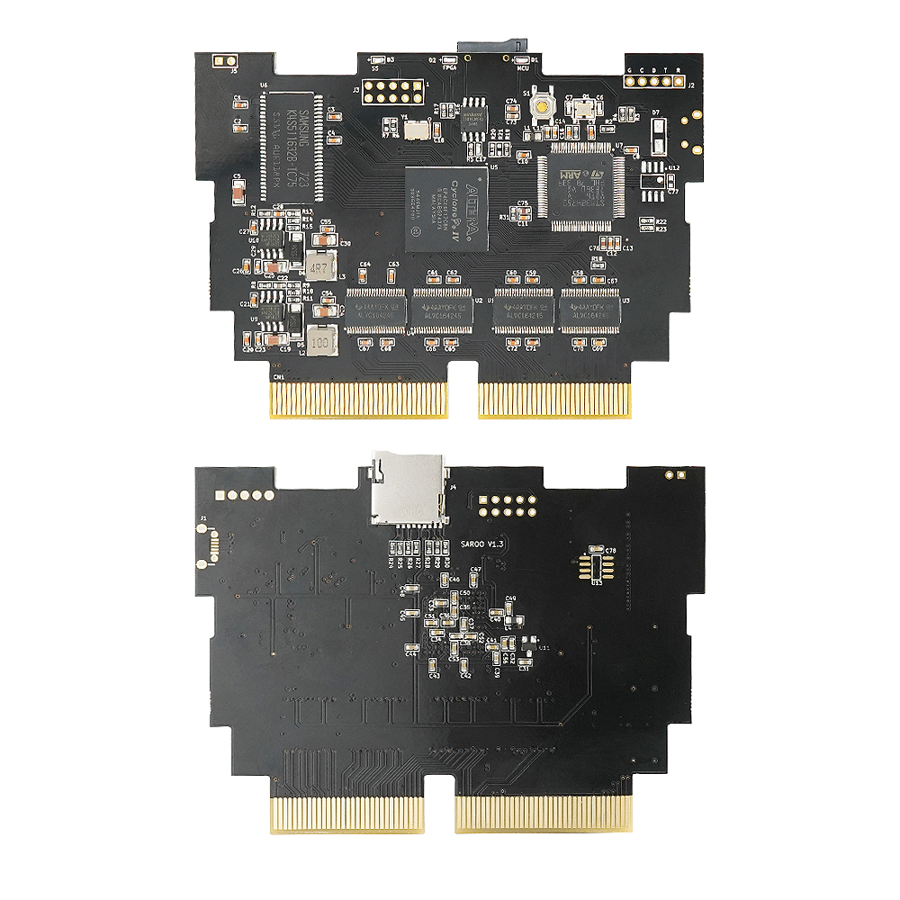

# SAROO

SAROO is a fully open-source CD drive emulator designed for the SEGA Saturn, perfect for both gamers and developers. Whether you want to relive your childhood classics or create your own homebrew games, SAROO has you covered. Load games from an SD card for a seamless gaming experience—SAROO makes it easy to enjoy endless fun!

**Firmware version:**  firm v0.7

**MCU:** 250222   **SS:**250222  **FPGA:**05[KLnM]

Changelog：

1. **Cover Display Functionality**
   Simply place the `cover.bin` file in the SAROO folder. Use the left arrow key to switch between cover display layers.
2. **Startup Disc Burning Functionality**
3. **Support for Virtual Memory Cards and System Saves Coexistence**
   Easily swap saves in the save management interface.
4. **Improved BIOS Compatibility**
5. **Improved Controller Compatibility**
6. **Added Translations for Greek, Polish, and Swedish**

**Hardware version**：Original  SAROO V1.3   MCU (STM32H750VBT6) FPGA(EP4CE6)

Changelog：

1. Added pull-up resistors for the SD card signal.
2. Added pull-up resistors for the FPGA_DONE signal.
3. Removed SPCLK from the Saturn card slot and added AA24.

